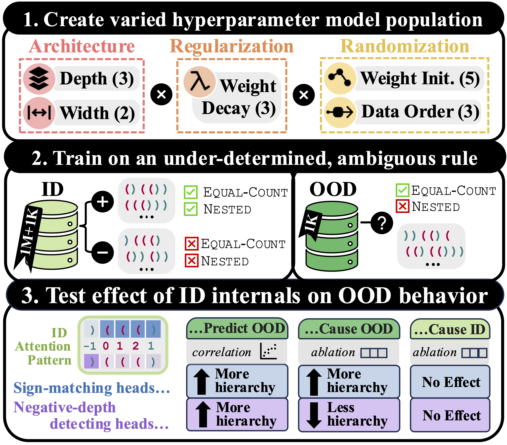

# Can interpretation predict behavior on unseen data?

Interpretability research often aims to predict how a model will respond to
targeted interventions on specific mechanisms. However, it rarely predicts
how a model will respond to unseen *input data*. This paper explores the
promises and challenges of interpretability as a tool for predicting
out-of-distribution (OOD) model behavior. Our findings offer a
proof-of-concept to motivate further interpretability work on predicting
unseen model behavior.

<p align="center">
    
</p>

---

## Repository layout

```
id-predict-ood/
├── README.md              ← this file
├── LICENSE
├── data/                  ← model outputs + head-property tables
├── execution/             ← model training (Dyck-1)
├── utils/                 ← minGPT + model wrappers
├── analysis/              ← original analysis notebooks
├── 03_30_ablation/        ← ablation experiments (uniform / mean / single-head)
├── 03_30_analysis/        ← classifier-style analyses (precision/recall)
├── first_symbol/          ← First-Symbol heuristic cluster analysis
├── experiments/           ← exploratory experiments
└── paper_figures/         ← scripts that produce every figure in the paper
                            (see paper_figures/README.md)
```

### `data/`

- `model_preds/` — per-example predictions of each Transformer on the 1K-example
  ID and OOD test sets (`indist_data_preds.csv`, `ood_data_preds.csv`).
- `model_weights/` — per-model checkpoints at 5 training steps (200K, 500K,
  600K, 800K, 1M). *Excluded from the public anonymized release for size; see
  "Reproducing from scratch" below.*
- `transformer_head_properties.csv` — for every (model, layer, head): fraction
  of ID/OOD sequences on which the head behaves as sign-matching,
  violation-detecting (`neg`), or generally hierarchical (`ambi`), at each
  training checkpoint.
- `transformers_sweep_data_cutoffs_vecs.csv`, `lstms_sweep_data_cutoffs_vecs.csv`
  — full hyperparameter sweep tables (weight decay, depth, seeds, ID/OOD acc
  per 1K examples seen).

### `analysis/` — original analysis notebooks

- `hyperparams_training_dynamics.ipynb` — impact of weight decay, depth, and
  seed on OOD rule selection and training dynamics.
- `preds_attention_heads.ipynb` — ID/OOD model predictions and behavior of
  hierarchical, sign-matching, and violation-detecting heads.

### `03_30_ablation/` and `03_30_analysis/`

Experiments accompanying the ablation section of the paper. The CSVs of
interest are:

- `03_30_ablation/dyck1/mean_ablation_results.csv` — per-model baseline /
  mean-ablation / uniform-ablation OOD accuracy.
- `03_30_ablation/dyck1/single_head_mean_ablation_results.csv` — ablating one
  head at a time.
- `03_30_analysis/analysis_2_classifier_results.csv` — classifier-style
  precision / recall for the head detector.
- `03_30_analysis/threshold_ablation_sensitivity.csv` — robustness to the
  hierarchical-head detection threshold.

### `execution/` and `utils/`

- `utils/minGPT/` + `utils/model.py` — model architecture.
- `execution/make_datasets/` — ID train + ID/OOD test data generation.
- `execution/train.py` — model training loop.

### `paper_figures/`

Each figure in the paper has a single corresponding script with a stable name
(`fig1b_qf_tsne.py`, `fig2a_dyck_split.py`, `fig2b_qf_split.py`,
`fig3_dyck_ablation_scatter.py`, `apx_attention_examples.py`,
`apx_qf_stats.py`, `qf_ablation_types.py`). See
[`paper_figures/README.md`](paper_figures/README.md) for the full mapping of
script $\leftrightarrow$ figure $\leftrightarrow$ paper section.

### Question Formation analysis

The Question Formation analysis uses checkpoints and analysis scripts from a
sibling repository (Qin et al., 2024); the entry points for our extensions are:

- `paper_figures/fig1b_qf_tsne.py` — produces Fig 1(b).
- `paper_figures/fig2b_qf_split.py` — produces Fig 2(b).
- `paper_figures/qf_ablation_types.py` — runs zero/mean/uniform ablation on
  the Subject-Binding heads (requires the QF model checkpoints).
- `paper_figures/apx_qf_stats.py` — produces the appendix numbers.

The underlying QF input data and pre-computed per-example outputs live in the
`hier_gen/question_formation/qf_analysis/` directory of the QF source tree.

## Reproducing from scratch

```bash
# 1. Train the 270 Dyck-1 Transformers
python execution/train.py --config configs/sweep.yaml

# 2. Compute per-model head behaviors
python 03_30_analysis/compute_head_properties.py

# 3. Run ablations
python 03_30_ablation/dyck1/run_ablation.py        # uniform + mean
python 03_30_ablation/dyck1/run_single_head.py     # one head at a time

# 4. Generate figures
python paper_figures/fig1b_qf_tsne.py
python paper_figures/fig2a_dyck_split.py
python paper_figures/fig2b_qf_split.py
python paper_figures/fig3_dyck_ablation_scatter.py
python paper_figures/apx_attention_examples.py
```

Model weights at all five checkpoints (~1.8 GB) are available on request;
contact the corresponding authors listed in the paper.

## License

MIT — see `LICENSE`.
