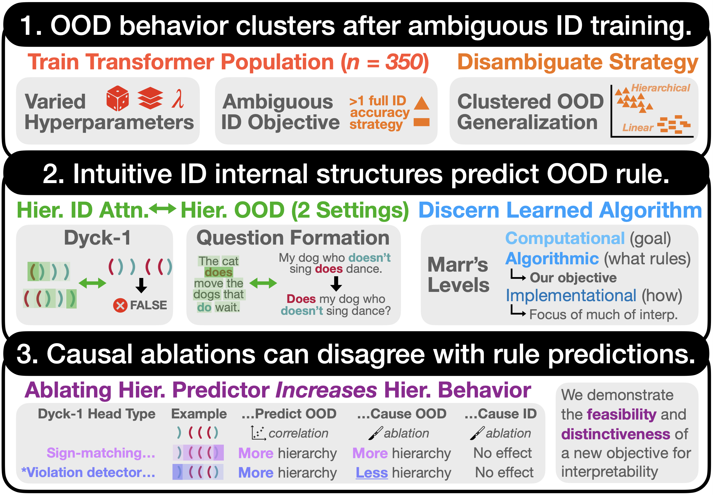

# Can interpretation predict behavior on unseen data?

Interpretability research often aims to predict how a model will respond to targeted interventions on specific mechanisms. However, it rarely predicts how a model will respond to unseen *input data*. This paper explores the promises and challenges of interpretability as a tool for predicting out-of-distribution (OOD) model behavior. Our findings offer a proof-of-concept to motivate further interpretability work on predicting unseen model behavior.

    

---

This repository consists of the data and code used in this project.

The `data` folder contains:
- `model_preds`: the predictions of each Transformer model across all 1K test ID and OOD datapoints (in `indist_data_preds.csv` and `ood_data_preds.csv`, respectively)
- `model_weights`: the internals of the 270 Dyck-1 Transformer models at 5 training checkpoints (200K, 500K, 600K, 800K, and 1M datapoints seen). Due to size, question-formation models are not released but replicable via [sunnytqin/hier_gen](https://github.com/sunnytqin/hier_gen/tree/main).
- `transformers_sweep_data_cutoff_vecs.csv`: the hyperparameters (weight decay, number of layers etc) of the trained Transformers models in addition to their ID and OOD accuracies and losses every 1K datapoints seen. `lstms_sweep_data_cutoff_vecs.csv` contains the same information for the trained LSTMs. 
- `transformer_head_properties.csv`: the proportion of ID or OOD datapoints (column names end in `indist` or `ood`) on which a particular model's attention heads are hierarchical (`ambi`), negative-depth detecting, sign-matching etc.

The `analysis` folder produces all figures included in the paper:
- `hyperparams_training_dynamics.ipynb` focuses on the impact of hyperparameters on OOD accuracy and training dynamics.
- `preds_attention_heads.ipynb` focuses on models' predictions ID and OOD, and the differing behavior of models with ID and OOD hierarchical, negative-depth detecting, and sign-matching heads
- `second_setting.ipynb` repeats the OOD accuracy and targeted causal-ablation analyses in the question formation setting, focusing on matrix-auxiliary-detecting heads

The `execution` and `utils` folders create the Transformer (and LSTM) models to investigate: 
- `execution/make_datasets` generates the ID train and ID and OOD test data for the models.
- `utils/model.py` along with `utils/minGPT` establishes the architecture of the models.
- `execution/train.py` trains the models and tracks the resulting data and weights.
- The other files help with these primary functions, and they set up dataframes for downstream analysis and plotting.
To get the question formation models, please use [sunnytqin/hier_gen](https://github.com/sunnytqin/hier_gen/tree/main).

The `question_formation_data` folder contains the data for our second setting, English question formation, which mirrors the Dyck-1 experiments above:
- `question_formation/`: the ID train and ID/OOD test data (`question.train`, `question.val`, `question.test`), along with the corresponding part-of-speech templates (`question.val.type`, `question.test.type`)
- `qf_p_hier_by_model_checkpoint_300000.csv`: each model's predicted `P(hierarchical auxiliary)` on every OOD test example at the 300K-datapoint checkpoint
- `qf_matrix_aux_detector_raw_quest_heads_300000.csv`: per-model, per-head scores against the matrix-auxiliary-detector pattern, used to identify which attention heads perform matrix-auxiliary detection
- `qf_matrix_aux_detector_raw_quest_membership_300000.csv`: per-model summary of whether it contains a matrix-auxiliary-detecting head, which heads those are, and the model's OOD accuracy
- `qf_ablation_single_head_300000.csv` and `qf_ablation_impact_300000.csv`: the effect on ID/OOD accuracy of ablating the matrix-auxiliary-detecting head(s) in each model, at the single-head and whole-model level respectively
- `qf_ablation_impact_table_300000.csv`: the resulting ablation impact distributions (mean, CI, % damaged/improved) summarized by ablation type and by whether the model contains the head of interest
