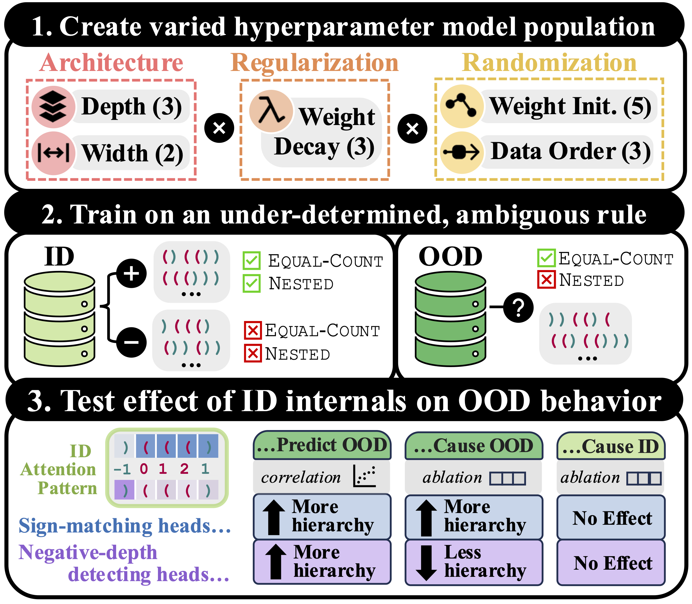

# Can interpretation predict behavior on unseen data?

Interpretability research often aims to predict how a model will respond to targeted interventions on specific mechanisms. However, it rarely predicts how a model will respond to unseen *input data*. This paper explores the promises and challenges of interpretability as a tool for predicting out-of-distribution (OOD) model behavior. Our findings offer a proof-of-concept to motivate further interpretability work on predicting unseen model behavior.

    

---

This repository contains data and code used in this project.

The `data` folder contains:
- `model_preds`: the predictions of each Transformer model across all 1K test ID and OOD datapoints (in `indist_data_preds.csv` and `ood_data_preds.csv`, respectively)
- `model_weights`: the internals of the 270 Transformer models at 5 training checkpoints (200K, 500K, 600K, 800K, and 1M datapoints seen)
- `transformers_sweep_data_cutoff_vecs.csv`: the hyperparameters (weight decay, number of layers etc) of the trained Transformers models in addition to their ID and OOD accuracies and losses every 1K datapoints seen. `lstms_sweep_data_cutoff_vecs.csv` contains the same information for the trained LSTMs. 
- `transformer_head_properties.csv`: the proportion of ID or OOD datapoints (column names end in `indist` or `ood`) on which a particular model's attention heads are hierarchical (`ambi`), negative-depth detecting, sign-matching etc.

The `analysis` folder produces all figures included in the paper:
- `hyperparams_training_dynamics.ipynb` focuses on the impact of hyperparameters on OOD accuracy and training dynamics.
- `preds_attention_heads.ipynb` focuses on models' predictions ID and OOD, and the differing behavior of models with ID and OOD hierarchical, negative-depth detecting, and sign-matching heads

The `execution` and `utils` folders create the Transformer (and LSTM) models to investigate: 
-   `execution/make_datasets` generates the ID train and ID and OOD test data for the models.
- `utils/model.py` along with `utils/minGPT` establishes the architecture of the models.
- `execution/train.py` trains the models and tracks the resulting datasets.
- The other files help with these primary functions, and they set up dataframes for downstream analysis and plotting.

